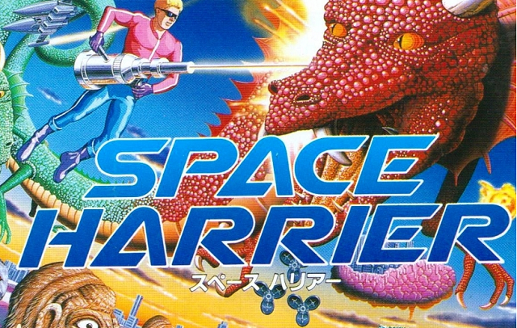

_This project is part of the Master on Videogame Development (Programming), coursed on the UPC School (Barcelona) and developed by Xavier Bravo Guillen._

## Space Harrier? What's that?

Space Harrier is an arcade game that was developed by SEGA on 1985. It is considered the father of the third-person rail shooter games. This game
has appeared in an long list of platforms as a single game or appearing on Collections, establishing itself as an absolute classic!

Official Wikipedia page: https://en.wikipedia.org/wiki/Space_Harrier  
Original game Youtube gameplay: https://www.youtube.com/watch?v=Hzgrb-mjLaM

The Tribute:
<iframe width="560" height="315" src="https://www.youtube.com/embed/teL41Dd8_38" frameborder="0" gesture="media" allow="encrypted-media" allowfullscreen></iframe>

## Game Objective - HOW DO I WIN?!:

You're out there, alone, in the Fantasy Zone. With an unlimited ammo handcannon and your own skills you will have to dodge or
destroy any obstacle, enemy or threat that tries to stop you. Fight through the level until you're ready to face the final
boss, the big bad Green Dragon.

Raise your score by taking down objectives while you dodge their attacks and make yourself a proud conqueror of the Fantasy Zone!

## Controls and Gameplay - HOW DO I PLAY?!:

### General Controls:
- W, A, S, D: Move around to dodge and position yourself!
- Space: Shoot your laser (Don't worry, lasers got no ammo).
- Enter/Return: Pause the game.

### Debug keys:
So, you wanna take a closer look to the game, don't you? Use this keys to give you a hint about some details of the game or just enjoying it without threats!  
- F1 Key: Activate/Deactivate visible colliders.
- F2 Key: GODMODE! You won't be able to die on this mode so just enjoy the scenario!	

## Download Space Harrier Tribute (Latest Release):

https://github.com/BravoXavi/Space-Harrier-Tribute/releases/download/v1.0/SpaceHarrierTribute_v1.0.zip

## Credits and License - WHO ARE YOU?!:

- **Author:** Xavier Bravo Guillen  
- **Repository:** https://github.com/BravoXavi/Space-Harrier-Tribute
- **License:** MIT License